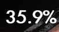
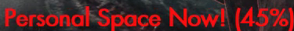
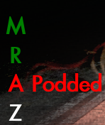
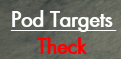
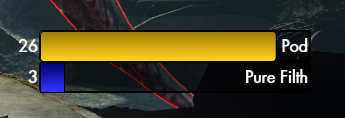
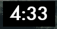
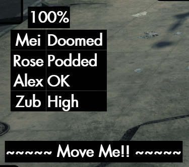

# A Lurker Is Announced (ALIA)
This Secret World Legends addon provides announcements for important events in the Manhattan Exclusion Zone.

## Audible Warnings

There are three audible warnings, each of which is a short sequence of beeps. They play when:
- Every time the lurker crosses a Personal Space threshold to warn of the impending cast (E10 only)
- When the lurker casts From Beneath You It Devours (pod), mostly so cleansers in E10 know to cast Cleanup.
- When a hulk spawns in phase 3 (disabled by default).
These can be enabled and disabled using the following in-game commands:
`/setoption alia_ps_sound (true/false)`
`/setoption alia_pod_sound (true/false)`
`/setoption alia_hulk_sound (true/false)`

## Displays

Currently there are seven displays that appear. The displays only appear when in the Manhattan Exclusion Zone, the addon basically goes to sleep outside of that zone.

### Health % Display 
 

Shows the Lurker's current health percentage. Remains active even when the Lurker is not targetable

### Warning Display 

Displays warnings for the following casts:
- Shadow out of Time (first one only, at 75%)
- Personal Space (67%, 45%, 25%)
- Final Resort (2.5% on Story Mode, 5% on all elite difficulties)
Also displays a "coming soon" warning before the cast threshold (3% ahead by default, user-configurable). These warnings fade out quickly when the spell is cast.

The warn-ahead percentage can be set with the following command (this will set it to 5% ahead):
`/setoption alia_warnpct 5`   
    

### NPC Display 

Changes based on phase
- Phase 1: Hidden (no NPCs to track)
- Phase 2: Shows number of Birds (B) & number of Downfalls (D) cast by current bird
- Phase 3: Displays the status of each NPC as a color-coded letter (or optionally, name)
  - Also displays warning text for "Podded" and "Doomed" (pod incoming) NPCs.
  - Color codes are:
    - Green: Providing Buff
    - Yellow: Targeted by pod
    - Red: Podded
    - Grey: Incapacitated (waiting to be picked up)
    - White: Not providing buff, but no status ailments (i.e. while running back to their spot)
    - Black: NPC not yet detected (usually most of phase 1 & 2)
  - Letters are just M (Mei Ling / Melee), R (Rose / Mid-range), A (Alex / AR range), and Z (Zuberi)
    - `/setoption alia_shownames true` will enable full names ("Mei", "Rose", "Alex", and "Zub")
    - Zuberi is automatically enabled in E17, but disabled by default in other difficulties. 
    - If you want to see what he's up to, you can enable him with `/setoption alia_zuberi true`

### Pod Targets Display 

Shows which players are about to be podded (Doomed) or are podded (Podded)
  - Uses the same color-coding as the NPC display (yellow for Doomed, red for podded)
  - Should automatically show/hide itself as needed based on whether people are podded
  
### Cooldown Tracking Bars

Show remaining cooldowns on Pure Filth and From Beneath You It Devours (Pod). Automatically hides during phase 2 when they aren't relevant.

### Countdown Timer

Ten-minute countdown timer to help gague progress. Also to make those last-second kills even more epic.

### Cast Bar
A cast bar for the lurker that shows even when the lurker isn't your current target. Can be toggled using `/setoption alia_castbar (true/false)` and resized using `/setoption alia_castbar_scale #` (default: 1)

## Addon Layout
The displays can be moved (click & drag) in GUIEdit mode, and save their position between sessions.

## Installation

To install the addon, download the zip file of the [latest release](https://github.com/theckhd/ALIA/releases) (i.e. ALIA-v###.zip), and extract it to your game's "\Secret World Legends\Data\Gui\Custom\Flash\" folder.

