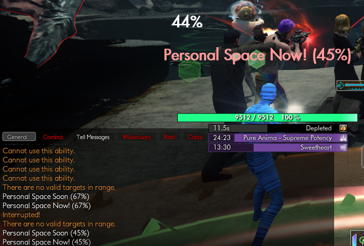
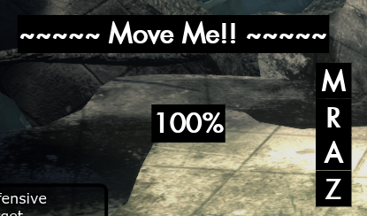

# A Lurker Is Announced (ALIA)
This Secret World Legends addon provides announcements for important events in the Manhattan Exclusion Zone.

Currently there are two text fields that appear:
- A health display 
  - This shows the Lurker's current health percentage
  - It remains active even when the Lurker is not targetable
- A warning display
  - Displays warnings for the following casts:
    - Shadow from Below (first one only, at 75%)
    - Personal Space (67%, 45%, 25%)
    - Final Resort (3%)
  - Also displays a "coming soon" warning 2%-3% before the cast threshold
  - These warnings fade out quickly when the spell is cast
  
The displays only appear when in the Manhattan Exclusion Zone, the addon basically goes to sleep outside of that zone.

The displays can be moved (click & drag) in GUIEdit mode, and save their position between sessions.

There are no user-configurable options at this time.
