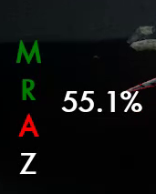

# A Lurker Is Announced (ALIA)
This Secret World Legends addon provides announcements for important events in the Manhattan Exclusion Zone.

Currently there are three text fields that appear. The displays only appear when in the Manhattan Exclusion Zone, the addon basically goes to sleep outside of that zone.

 

- A health display 
  - This shows the Lurker's current health percentage
  - It remains active even when the Lurker is not targetable

- A warning display
  - Displays warnings for the following casts:
    - Shadow from Below (first one only, at 75%)
    - Personal Space (67%, 45%, 25%)
    - Final Resort (3%)
  - Also displays a "coming soon" warning before the cast threshold (3% ahead by default, user-configurable)
  - These warnings fade out quickly when the spell is cast
 
  - The warn-ahead percentage can be set with the following command (this will set it to 5% ahead):

    - `/setoption alia_warnpct 5`   
    

- An NPC display
  - Displays the status of each NPC as a color-coded letter
  - Color codes are:
    - Green: Providing Buff
    - Yellow: Targeted by pod
    - Red: Podded
    - Grey: Incapacitated (waiting to be helped up)
    - White: Not providing buff, but no status ailments (i.e. while running back to their spot)
    - Black: NPC not yet detected (usually most of phase 1 & 2)
  - Letters are just M (Mei Ling / Melee), R (Rose / Mid-range), A (Alex / long range), and Z (Zuberi)
    - I realize Zuberi is sort of useless, I'll probably turn off his display in a future release
    

The displays can be moved (click & drag) in GUIEdit mode, and save their position between sessions.

