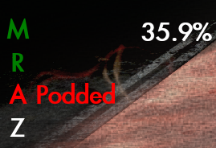
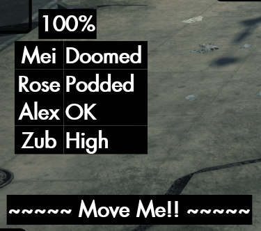

# A Lurker Is Announced (ALIA)
This Secret World Legends addon provides announcements for important events in the Manhattan Exclusion Zone.

## Audible Warnings

There are two audible warnings, each of which is a short sequence of beeps. They play when:
- Every time the lurker crosses a Personal Space threshold to warn of the impending cast (E10 only)
- When the lurker casts From Beneath You It Devours (pod), mostly so cleansers in E10 know to cast Cleanup.

## Displays

Currently there are three displays that appear. The displays only appear when in the Manhattan Exclusion Zone, the addon basically goes to sleep outside of that zone.

 

- A health display 
  - This shows the Lurker's current health percentage
  - It remains active even when the Lurker is not targetable

- A warning display
  - Displays warnings for the following casts:
    - Shadow from Below (first one only, at 75%)
    - Personal Space (67%, 45%, 25%)
    - Final Resort (3%)
  - Also displays a "coming soon" warning before the cast threshold (3% ahead by default, user-configurable)
  - These warnings fade out quickly when the spell is cast
 
  - The warn-ahead percentage can be set with the following command (this will set it to 5% ahead):

    - `/setoption alia_warnpct 5`   
    

- An NPC display
  - Displays the status of each NPC as a color-coded letter
  - Also displays warning text for "Podded" and "Doomed" (pod incoming) NPCs.
  - Color codes are:
    - Green: Providing Buff
    - Yellow: Targeted by pod
    - Red: Podded
    - Grey: Incapacitated (waiting to be picked up)
    - White: Not providing buff, but no status ailments (i.e. while running back to their spot)
    - Black: NPC not yet detected (usually most of phase 1 & 2)
  - Letters are just M (Mei Ling / Melee), R (Rose / Mid-range), A (Alex / long range), and Z (Zuberi)
    - Zuberi is turned off by default. If you want to see what he's up to, you can enable him with 
      - `/setoption alia_zuberi true`

The displays can be moved (click & drag) in GUIEdit mode, and save their position between sessions.

## Installation

To install the addon, download the zip file of the [latest release](https://github.com/theckhd/ALIA/releases) (i.e. ALIA-v0.x.zip), and extract it to your game's "\Secret World Legends\Data\Gui\Custom\Flash\" folder.

